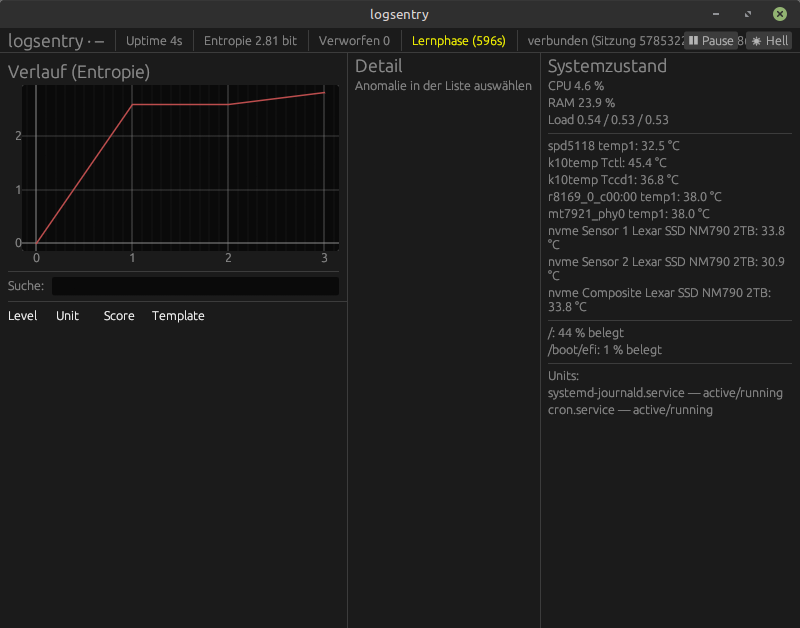

# logsentry

Ressourcenschonendes Sysadmin-Dashboard für Linux: liest den
systemd-Journal-Stream in Echtzeit, normalisiert Log-Zeilen zu Templates
und meldet Auffälligkeiten mit rein statistischen Verfahren (Entropie,
robuster Z-Score, Surprisal) — ohne Cloud-Dienst, ohne LLM-Aufrufe im
Hot Path. Ein privilegierter Collector-Daemon sammelt und analysiert,
eine GUI unter dem eigenen Benutzerkonto zeigt Live-Daten an und kann
(mit ausdrücklicher Bestätigung) reagieren: Unit neu starten/stoppen,
Prozess beenden, IP befristet sperren, Anomalie stummschalten.



## Architektur

```
journalctl -f -o json → Ingestion → Normalizer → Analyse → SharedState
                                                              │
                                          Unix-Socket (JSON-Lines)
                                                              │
                                                        GUI-Client
```

Der Daemon (`logsentry-daemon`) läuft privilegiert als systemd-Unit und
öffnet einen Unix-Socket unter `/run/logsentry/collector.sock`. Die GUI
(`logsentry-gui`) läuft **niemals als root**, verbindet sich als reiner
Client über diesen Socket und liest/schreibt keine privilegierten
Ressourcen selbst. Details zum Protokoll: [`docs/phase6-protokoll.md`](docs/phase6-protokoll.md);
zum Aktions-Subsystem: [`docs/phase8-aktionen.md`](docs/phase8-aktionen.md).

## Installation

Voraussetzungen: Rust (stable, via [rustup](https://rustup.rs)), ein
Linux-System mit systemd und D-Bus. `nft` (nftables) wird nur für die
Aktion „IP sperren“ gebraucht.

```sh
git clone <repo-url> logsentry
cd logsentry
cargo build --release
sudo ./packaging/install.sh
```

Das Skript legt die Systemgruppe `logsentry` an, kopiert die Binaries
nach `/usr/local/bin`, installiert eine Beispiel-Konfiguration nach
`/etc/logsentry/logsentry.toml` (falls noch keine existiert), die
systemd-Unit (`packaging/systemd/logsentry.service`) und einen
Menüeintrag für die GUI (`packaging/logsentry.desktop`).

Danach, wie am Ende des Skripts ausgegeben:

```sh
sudo usermod -aG logsentry "$USER"   # einmalig, danach ab-/anmelden
sudo systemctl enable --now logsentry.service
logsentry-gui
```

## Rechtevergabe

- **Der Daemon läuft privilegiert** (als root, siehe Begründung in
  `packaging/systemd/logsentry.service`): Journal-Lesezugriff, D-Bus-
  Aufrufe an `systemd1.Manager` (Unit-Neustart/-Stopp) und `nft`
  (IP-Sperren, braucht `CAP_NET_ADMIN`) verlangen das. Die Unit ist
  trotzdem gehärtet: `ProtectSystem=strict`, `ProtectHome=yes`,
  `NoNewPrivileges=yes`, eigenes `RuntimeDirectory`/`StateDirectory`.
- **Die GUI läuft nie als root** (Regel 7 des Projekts) und verbindet
  sich nur über den Socket. Zugriff auf den Socket bekommt, wer
  Mitglied der Gruppe `logsentry` ist (`sudo usermod -aG logsentry
  <Benutzer>`) — der Socket selbst hat Modus `0660`.
- **Ohne Root-Betrieb** (Entwicklung/Test): `[socket].group = ""` in der
  Konfiguration setzt den Socket-Pfad z. B. unter `$XDG_RUNTIME_DIR`
  ohne `chown`-Versuch.
- Für den Ingestion-Zugriff auf das Journal ohne root muss der
  Daemon-Benutzer in der Gruppe `systemd-journal` oder `adm` sein — bei
  Betrieb als root (Standard-Unit) ist das nicht nötig.

## Konfiguration

Alle Einstellungen liegen in `/etc/logsentry/logsentry.toml`
(Referenz mit Kommentaren: `packaging/logsentry.toml.example`, Schema:
`core/src/config.rs`). Jedes Feld hat einen sinnvollen Default; die
Datei muss nur enthalten, was vom Default abweichen soll. Fehlt sie
ganz, startet der Daemon trotzdem — mit sicheren Vorgaben.

Wichtigster Abschnitt vor dem produktiven Einsatz ist `[actions]`
(siehe unten).

## Aktionen

Das Aktions-Subsystem ist standardmäßig **komplett deaktiviert**
(`allowed_kinds = []`) und läuft zusätzlich global im **Dry-Run**
(`dry_run = true`): Jeder Versuch wird geprüft und im Audit-Log
protokolliert, aber nichts wird wirklich ausgeführt, bis beides bewusst
geändert wird.

Verfügbare Aktionen:

| Aktion | Ausführung | Voraussetzung in `[actions]` |
|---|---|---|
| Unit neu starten / stoppen | D-Bus (`org.freedesktop.systemd1`), kein `systemctl`-Subprozess | `allowed_kinds` **und** die Unit in `allowed_units` |
| Prozess beenden | SIGTERM sofort, SIGKILL nach Ablauf einer Gnadenfrist (Default 5 s) | `allowed_kinds` |
| IP befristet sperren | `nft`-Set mit Timeout (Default-Grenzen 60 s – 7 Tage) | `allowed_kinds`, `nft` im Pfad, `CAP_NET_ADMIN` |
| Anomalie stummschalten | reiner Zustandseintrag im Daemon (1 h / 1 Tag / dauerhaft) | `allowed_kinds` |

Jede Aktion durchläuft zusätzlich ein Rate-Limit (Default: 3 Versuche je
Aktionsart und Ziel pro 10 Minuten) und wird als JSON-Zeile ins
Audit-Log geschrieben (`[actions].audit_log_path`, Default
`/var/lib/logsentry/audit.jsonl`). In der GUI löst ein Button nie
direkt eine Aktion aus — erst ein Bestätigungsdialog mit Vorschau; die
Ergebnisse dieser Sitzung erscheinen im Systemzustands-Panel unter
„Aktionen dieser Sitzung“.

Nach einer ausgeführten `RestartUnit`/`StopUnit`/`TerminateProcess`-
Aktion filtert der Daemon deren eigene Folgezeilen für ein kurzes
Zeitfenster (Default 30 s) aus der Anomalie-Erkennung heraus, damit die
Aktion nicht ihre eigene nächste Anomalie auslöst.

## Entwicklung

```sh
just check-all      # cargo check + clippy -D warnings + test
just run-daemon      # Daemon mit cargo run starten
just run-gui         # GUI mit cargo run starten
```

Replay-Modus zum Testen ohne auf Echtzeit-Logs zu warten:

```sh
cargo run -p logsentry-daemon -- --since "2026-01-01 00:00:00"
```

Referenz-Client für den Socket (z. B. um im Replay-Modus zu beobachten,
was tatsächlich gesendet wird):

```sh
cargo run -p logsentry-proto --features client --example tail -- /run/logsentry/collector.sock
```

## Zielsysteme

Linux Mint Desktop (primär, grafische Oberfläche) und ein kleiner
Heimserver (Haswell-Klasse, headless). Auf dem Desktop gemessene
Leerlauf-Last (`--release`, siehe `docs/phase6-protokoll.md` Abschnitt 9
und den Phase-7-Commit): Daemon ~0 % CPU / 22 MB RSS, GUI ~0 % CPU /
73 MB RSS — die Messung auf dem Heimserver selbst steht noch aus.
